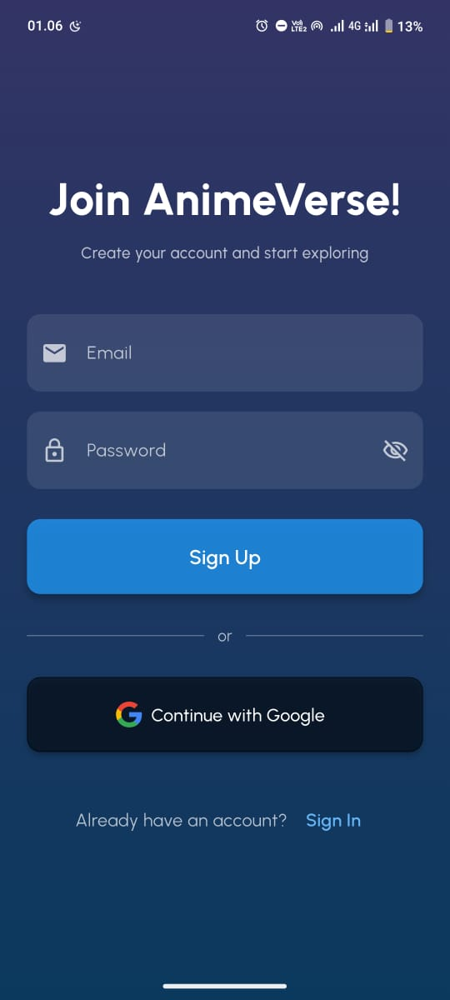
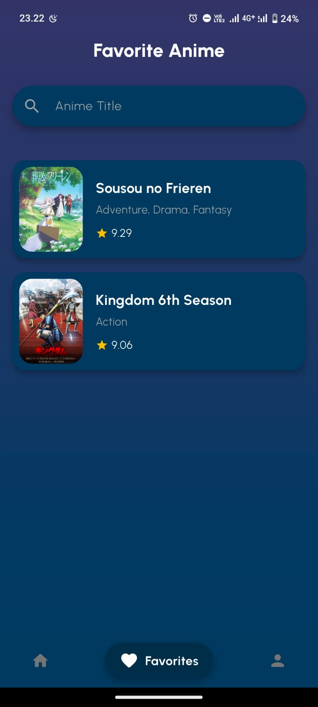
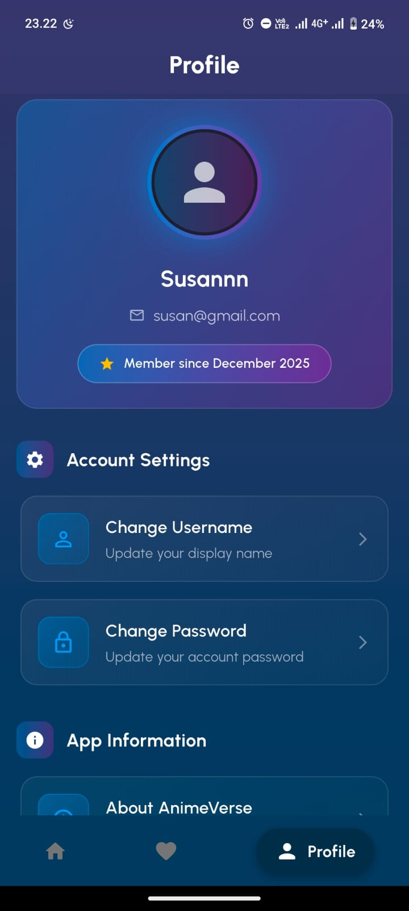

### About Me 
Name: Susan Jong 

NIM: 231401014

# 📱 AnimeVerse – Discover Anime Anytime, Anywhere

AnimeVerse is a modern Flutter application designed to help users explore anime titles, read detailed synopses, and save their favorite shows.
This project is currently under development and integrates directly with the Jikan API, with plans to implement a dedicated backend service in future releases.

## !Check the Latest Release AnimeVerse app

Welcome to the AnimeVerse repository!

You can always download the newest version of the app directly from the Releases section.

🔽 Download APK (Latest Release)

To install AnimeVerse on your android device, check the new release and search file name and download the file below:

[👉 apk-release.apk](https://github.com/susanjong/AnimeVerse_Mobile/releases/tag/v1.0.0)

(Click to download and install on your android phone)

Minimum Android version: Android 5.0 (API 21) or higher.

## 🌟 Key Features

🔍 Anime Search
Search anime titles instantly using Jikan API keyword-based queries.

📚 Detailed Anime Information
View complete details such as synopsis, type, episodes, release year, and more.

❤️ Favorites Screen
Save and manage your favorite anime list with ease.

♾️ Infinite Scroll
Load anime data seamlessly as you scroll.

⏳ Smart UI States
Clean loading, error, and empty states for better user experience.

## 🧩 Tech Stack

Framework: Flutter

Language: Dart

API Source: Jikan API

State Management: Provider

HTTP Client: http package

Repository for Dart an Flutter packages : https://pub.dev

## 📦 Installation
git clone https://github.com/susanjong/anime_verse.git

Do 3 steps in here, run into terminal

`cd anime_verse

flutter pub get

flutter run`

📡 API Integration (Temporary)

AnimeVerse temporarily uses the Jikan REST API as its main data source until the backend service is completed.
API Reference: https://api.jikan.moe/v4/

Example request:

GET https://api.jikan.moe/v4/anime?q=naruto

## 📁 Project Structure

lib/

├── config/

├── providers/

├── repositories/

├── models/

├── services/

├── screens/

│ ├── home/

│ ├── detail/

│ └── favorites/

├── widgets/

└── main.dart

## Application Screenshoot 
1. Splash screen

2. Sign In dan Sign Up

3. Home Screen

4. Favorite Anime 

5. Profile

## Link Demo Application
https://youtu.be/8gOzXb8fv4Q go check now!

## 🔥 Firebase Setup (Required)

To enable authentication and future backend features, Firebase must be configured in your local project.

1️⃣ Create a Firebase Project

Go to Firebase Console
https://console.firebase.google.com

Click Add Project → enter your project name → continue.

Wait for the project to be created.

2️⃣ Add an Android App to Firebase

In Firebase Console, open your project → Project Overview → Add App → select Android.

Enter the following values:

Android package name:

com.example.anime_verse

App nickname (optional)

SHA-1 (optional but recommended)

Download the generated file:

google-services.json

Place it into your Flutter project at:

android/app/google-services.json

3️⃣ Enable Firebase Authentication

Go to Build → Authentication.

Select Get Started.

Enable Email/Password sign-in method.

4️⃣ Add Firebase SDK to Flutter

Run this in your terminal:

`flutter pub add firebase_core
flutter pub add firebase_auth`

5️⃣ Install FlutterFire CLI (if not installed)
`dart pub global activate flutterfire_cli`

6️⃣ Configure Firebase Automatically

Run the FlutterFire setup from the root folder of your project:

`flutterfire configure`

This command will auto-generate the file:

lib/firebase_options.dart

and link your Android app to Firebase.

7️⃣ Initialize Firebase in main.dart

Add and copy this to your code:

`import 'package:firebase_core/firebase_core.dart';

import 'firebase_options.dart';

void main() async {

WidgetsFlutterBinding.ensureInitialized();

await Firebase.initializeApp(

    options: DefaultFirebaseOptions.currentPlatform,

);

runApp(const MyApp());

}`

8️⃣ Add Google Services Plugin (Android)

`Confirm your android/app/build.gradle contains:

apply plugin: 'com.google.gms.google-services'`

And in android/build.gradle:

`classpath 'com.google.gms:google-services:4.4.2'`

9️⃣ Clean & Run the Project in terminal

`flutter clean`

`flutter pub get`

`flutter run`

## 📄 License – MIT License (Attribution Required)

Copyright (c) 2025 Susaan Jong
GitHub: https://github.com/susanjong

Permission is hereby granted, free of charge, to any person obtaining a copy
of this software and associated documentation files (the “Software”), to deal
in the Software with the following conditions:

Proper credit to the original author (GitHub: susanjong) is required.

Reuploading, redistributing, or claiming this work as your own without attribution is strictly prohibited.

Copies or substantial portions of the software must include this license notice.
